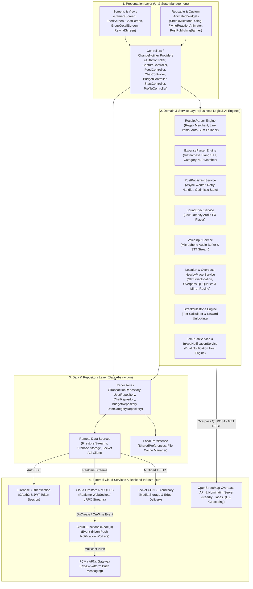
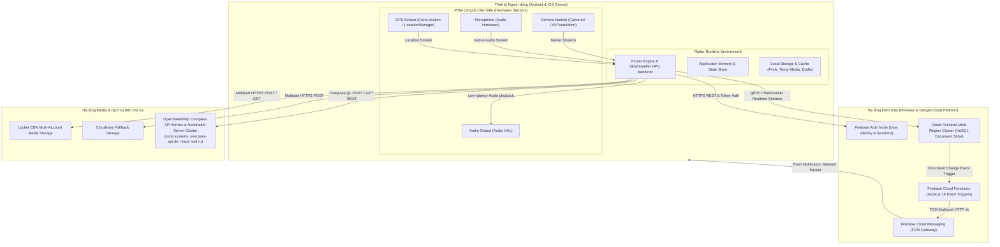
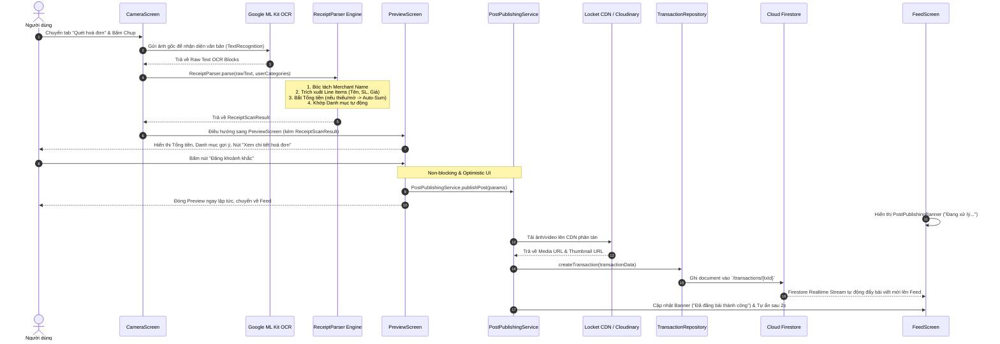
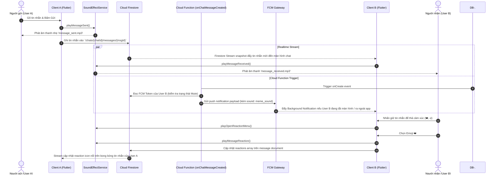
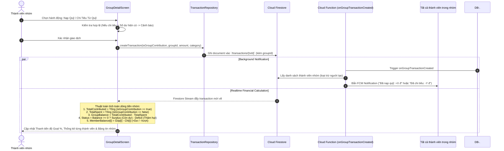
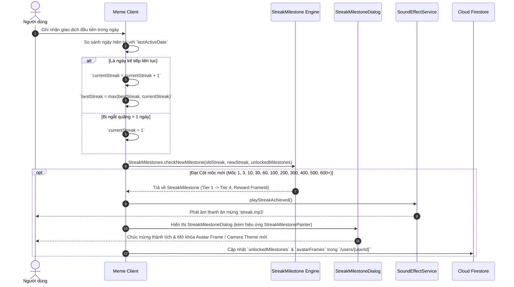
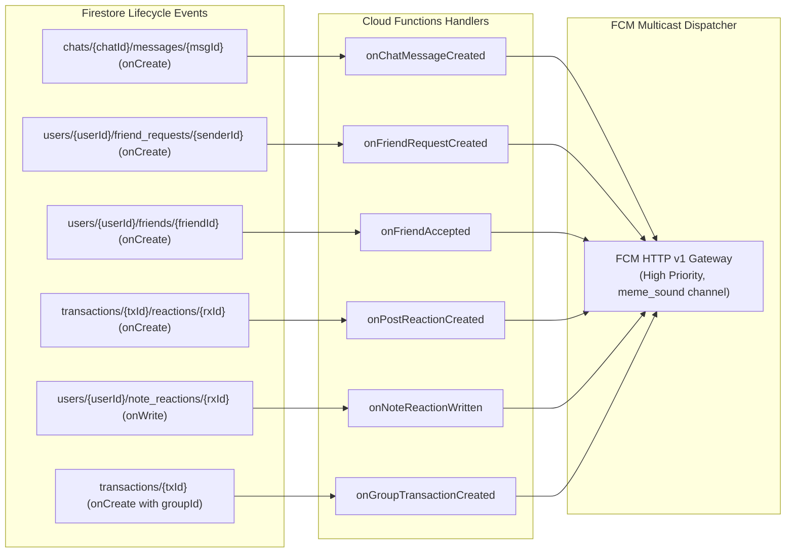

# 📱 TÀI LIỆU TỔNG HỢP TOÀN BỘ TÍNH NĂNG & KIẾN TRÚC KỸ THUẬT ỨNG DỤNG MEME (V2.5)
> **Meme — Gen Z Social Expense Tracker & Visual Spending Diary**  
> *"Every expense tells a story."*  
> Mô hình ứng dụng kết hợp đột phá giữa **Quản lý tài chính cá nhân & Quỹ nhóm chuyên sâu** và **Mạng xã hội chia sẻ khoảnh khắc chi tiêu phong cách Locket**.

---

# 📖 PHẦN I: TÀI LIỆU TÍNH NĂNG ỨNG DỤNG (PRODUCT FEATURES)

## 📑 MỤC LỤC TÍNH NĂNG

1. [Xác thực & Quản lý Tài khoản (Authentication & Account Management)](#1-xác-thực--quản-lý-tài-khoản)
2. [Ghi nhận Thu / Chi & Trợ lý Nhập liệu (Smart Expense Input, Voice Parser & Instant Edit)](#2-ghi-nhận-thu--chi--trợ-lý-nhập-liệu)
3. [Quét Hóa Đơn Tự Động Hóa Bằng AI OCR (Smart Receipt Scanner & Parser Engine)](#3-quét-hóa-đơn-tự-động-hóa-bằng-ai-ocr)
4. [Đăng Bài Ngầm Tối Ưu Trải Nghiệm (Asynchronous Background Publishing)](#4-đăng-bài-ngầm-tối-ưu-trải-nghiệm)
5. [Camera Khoảnh khắc Locket & Studio Đa Phương Tiện (Square Viewfinder & Media Studio)](#5-camera-khoảnh-khắc-locket--studio-đa-phương-tiện)
6. [Lịch Kỷ niệm Polaroid & Tra cứu Khoảnh khắc (Threaded Polaroid Calendar & History)](#6-lịch-kỷ-niệm-polaroid--tra-cứu-khoảnh-khắc)
7. [Bảng tin Tương tác Xã hội & Cảm xúc Bay (Social Feed & Flying Reactions)](#7-bảng-tin-tương-tác-xã-hội--cảm-xúc-bay)
8. [Hệ thống Trò chuyện Thời gian thực & Âm thanh Sống động (Realtime Chat & Audio FX)](#8-hệ-thống-trò-chuyện-thời-gian-thực--âm-thanh-sống-động)
9. [Mạng lưới Bạn bè, Biệt danh & Quản lý Quỹ nhóm Toàn diện (Friends & Deep Group Fund)](#9-mạng-lưới-bạn-bè-biệt-danh--quản-lý-quỹ-nhóm-toàn-diện)
10. [Quản lý Ngân sách & Cảnh báo Hạn mức (Dynamic Budgeting System)](#10-quản-lý-ngân-sách--cảnh-báo-hạn-mức)
11. [Thống kê, Báo cáo, So sánh Chu kỳ & Bản đồ Chi tiêu (Analytics & Interactive Map)](#11-thống-kê-báo-cáo-so-sánh-chu-kỳ--bản-đồ-chi-tiêu)
12. [Tổng kết Chi tiêu dạng Story Chuyển động (Meme Rewind / Financial Wrapped)](#12-tổng-kết-chi-tiêu-dạng-story-chuyển-động-meme-rewind)
13. [Gamification, Mốc Kỷ lục Chuỗi Streak & Cá nhân hóa (Milestones & Customization)](#13-gamification-mốc-kỷ-lục-chuỗi-streak--cá-nhân-hóa)
14. [Đa ngôn ngữ, Thông báo Kép & Hạ tầng Hệ thống (System & Dual Notifications)](#14-đa-ngôn-ngữ-thông-báo-kép--hạ-tầng-hệ-thống)
15. [Lộ trình Phát triển Tiếp theo (Future Roadmap)](#15-lộ-trình-phát-triển-tiếp-theo-future-roadmap)

---

## 1. XÁC THỰC & QUẢN LÝ TÀI KHOẢN

- **Đăng ký tài khoản (Register)**:
  - Đăng ký bảo mật qua Email & Mật khẩu.
  - Thiết lập thông tin hồ sơ ban đầu: Tên hiển thị (Display Name), `@username` duy nhất toàn hệ thống (3-20 ký tự hợp lệ), ảnh đại diện.
  - Tự động đồng bộ hồ sơ lên Firestore (`/users/{userId}`).
- **Đăng nhập & Phiên làm việc (Login & Sessions)**:
  - Đăng nhập bảo mật qua Firebase Authentication.
  - Tự động duy trì phiên đăng nhập và tự động làm mới access token.
- **Quên mật khẩu & Khôi phục (Forgot Password)**:
  - Gửi email đặt lại mật khẩu an toàn theo tiêu chuẩn quốc tế.
- **Quản lý Hồ sơ Cá nhân (Profile Management)**:
  - Cập nhật Tên hiển thị, Username.
  - Tải lên ảnh đại diện chất lượng cao với cơ chế xoay vòng CDN đa kênh.
- **Đổi Email Đăng nhập Trực tiếp (Change Email)**:
  - Màn hình đổi email chuyên dụng (`ChangeEmailScreen`) với quy trình xác thực mật khẩu hiện tại bảo mật cao.
  - Tự động cập nhật email trên cả Firebase Auth và cơ sở dữ liệu hồ sơ Firestore.
- **Chia sẻ Ghi chú Trạng thái 24h (24-Hour Ephemeral Status Notes)**:
  - Đăng ghi chú tâm trạng/suy nghĩ ngắn gọn hiển thị nổi bật trên đầu danh sách Chat và Bạn bè.
  - Tự động hết hạn và biến mất sau 24 giờ.
  - Bạn bè có thể bấm trực tiếp vào ghi chú để gửi tin nhắn phản hồi nhanh hoặc thả cảm xúc trên ghi chú đó.
- **Kiểm soát Trạng thái Hoạt động Thời gian thực (Online Presence Control)**:
  - Tùy chọn 3 cấp độ hiển thị: **Công khai (Public)**, **Bạn bè (Friends)**, hoặc **Tắt (None)**.
  - Hiển thị chấm xanh thời gian thực và thời gian hoạt động gần nhất trong danh sách Chat, Cuộc trò chuyện, và Danh sách Bạn bè.
  - **Chế độ công khai khi tìm kiếm**: Người khác tìm kiếm `@username` sẽ thấy chấm xanh nếu chủ tài khoản đang online và bật chế độ Public.
- **Đăng xuất & Quyền riêng tư xóa tài khoản (GDPR Compliant)**:
  - Đăng xuất an toàn, thu hồi FCM token trên thiết bị.
  - **Xóa vĩnh viễn tài khoản (Delete Account)**: Xác thực mật khẩu trước khi xóa sạch toàn bộ giao dịch, bạn bè, nhóm và dữ liệu media liên quan.

---

## 2. GHI NHẬN THU / CHI & TRỢ LÝ NHẬP LIỆU

- **Ghi chép Thu / Chi siêu tốc (Income & Expense Tracking)**:
  - Bàn phím số tích hợp bộ định dạng tiền tệ thông minh (`MoneyInputFormatter`) tự động hiển thị dấu phân cách hàng nghìn theo thời gian thực (giới hạn an toàn lên tới 12 chữ số).
  - Hỗ trợ đầy đủ 2 luồng phân loại: **Chi tiêu (Expense)** và **Thu nhập (Income)**.
  - Chọn danh mục chi tiêu trực quan từ hệ thống biểu tượng màu sắc đa dạng hoặc từ Danh mục Cá nhân tự tạo.
  - Phân tách rõ ràng giữa **Tiêu đề ảnh (Photo Caption)** hiển thị đè lên ảnh khoảnh khắc và **Ghi chú sổ sách (Expense Note)** lưu trữ nội bộ.
- **Nhập chi tiêu bằng Giọng nói 1-chạm (Speech-to-Text & Expense Parser Engine)**:
  - Thu âm nhận diện giọng nói tiếng Việt / tiếng Anh bằng micro 1 chạm (`VoiceInputService`).
  - **Bộ phân tích cú pháp ngôn ngữ tự nhiên độc quyền (`ExpenseParser`)**:
    - Bóc tách linh hoạt các từ ngữ và tiếng lóng chỉ số tiền: *"45 nghìn"*, *"50k"*, *"150 cành"*, *"1 củ rưỡi"*, *"hai trăm rưỡi"*, *"1 tỷ 200 triệu"*, *"trăm tỷ"*, v.v.
    - Tự động nhận diện từ khóa ngữ cảnh để gán Danh mục chính xác (*"ăn phở"* ➔ Ăn uống, *"đổ xăng"* ➔ Di chuyển, *"mua áo"* ➔ Mua sắm, *"nhận lương"* ➔ Thu nhập).
    - Tự động làm sạch chú thích và tự điền vào form giao dịch mà không cần bấm tay.
- **Chỉnh sửa Chi tiêu Trực tiếp (Edit Transaction Sheet)**:
  - Cho phép người dùng chỉnh sửa nhanh chóng mọi thông tin của giao dịch đã lưu (`EditTransactionSheet`): sửa số tiền, đổi danh mục, cập nhật caption ảnh, sửa ghi chú sổ thu chi và thay đổi danh sách bạn bè được tag.
  - Tự động đồng bộ cập nhật lại số dư ví, tiến độ ngân sách và dữ liệu bảng tin.
- **Đính kèm Vị trí Địa lý (GPS Reverse Geocoding & Check-in)**:
  - Tự động xác định tọa độ GPS chính xác tại thời điểm giao dịch.
  - Chuyển đổi tọa độ thành tên địa điểm, tên đường, quận/huyện, thành phố hiển thị trực quan trên thẻ Camera.
- **Gắn thẻ Bạn bè Scoped Thông minh (Scoped Mention Tagging)**:
  - Gõ `@` hoặc bấm nút `+ Tag bạn` để mở danh sách gợi ý bạn bè.
  - Bộ lọc gợi ý giới hạn an toàn theo quyền riêng tư của bài viết:
    - *Bạn bè (Friends)*: Chỉ gợi ý danh sách bạn bè 2 chiều.
    - *Bạn thân (Close Friends ⭐)*: Chỉ gợi ý những người trong danh sách Bạn thân.
    - *Nhóm quỹ (Group 👥)*: Giao thoa giữa thành viên nhóm và bạn bè (`Members ∩ Friends`).
    - *Riêng tư (Only Me 🔒)*: Vô hiệu hóa tính năng gắn thẻ.
  - **Tương tác khi bấm vào `@username` trên ảnh/bài viết**:
    - Bấm vào chính mình: Hiển thị badge *"Bạn (chính mình)"*.
    - Bấm vào người đã kết bạn: Mở nút *"Nhắn tin"* trò chuyện ngay.
    - Bấm vào người chưa kết bạn: Mở nút *"Thêm bạn bè"* / *"Đã gửi lời mời"*.
- **Quyền riêng tư bài viết 4 cấp độ (Granular Privacy Settings)**:
  - `friends` (**Bạn bè / Mọi người**): Chia sẻ với toàn bộ bạn bè 2 chiều trên Feed.
  - `close_friends` (**Bạn thân ⭐**): Chỉ bạn bè trong danh sách Bạn thân mới xem được.
  - `group` (**Nhóm 👥**): Đăng vào bảng tin nội bộ của nhóm quỹ chung.
  - `private` (**Chỉ mình tôi 🔒**): Lưu trữ sổ thu chi nội bộ cá nhân, không hiển thị trên Feed.

---

## 3. QUÉT HÓA ĐƠN TỰ ĐỘNG HÓA BẰNG AI OCR

> *Tính năng tự động hóa nhập liệu hóa đơn thông minh hàng đầu, giúp biến hóa đơn giấy/điện tử thành giao dịch hoàn chỉnh chỉ trong 1 lần chụp.*

- **Chế độ Máy ảnh Quét Bill Chuyên dụng (Dedicated Receipt Scan Mode)**:
  - Chuyển đổi linh hoạt giữa chế độ chụp **Khoảnh khắc (Moment)** và **Quét hoá đơn (Scan Receipt OCR)** ngay tại giao diện Camera.
  - Khung viền hướng dẫn căn chỉnh hóa đơn trực quan (Bill Alignment Viewfinder).
- **Bộ Phân Tích & Bóc Tách Hóa Đơn AI OCR (`ReceiptParser`)**:
  - **Nhận diện Tên Quán / Cửa hàng (Merchant)**: Tự động trích xuất tên chuỗi cửa hàng, quán cà phê, siêu thị, cây xăng (Highlands Coffee, The Coffee House, WinMart, Circle K, Petrolimex, CGV, Fahasa...).
  - **Bóc tách Danh sách Món (Line Items)**: Tự động phân tích từng dòng trong hóa đơn gồm Tên món/sản phẩm, Số lượng (Quantity) và Đơn giá (Price).
  - **Trích xuất Tổng tiền (Explicit Total)**: Bắt các từ khóa tổng thanh toán (*"Tổng cộng"*, *"Thành tiền"*, *"Tổng thanh toán"*, *"Total"*...).
- **Thuật toán Tự Động Cộng Dồn Thông Minh (Auto-Sum Fallback)**:
  - Khi hóa đơn bị rách phần dưới, bị che khuất hoặc chữ in bị mờ ở dòng tổng cộng, hệ thống sẽ **tự động tính tổng từ danh sách các món lẻ đã nhận diện** để đảm bảo số tiền không bị bỏ sót.
  - Hiển thị nhãn thông báo rõ ràng: *"Đã tự động cộng dồn từ các món trong hoá đơn"*.
- **Tự Động Khớp Danh Mục Chi Tiêu (Smart Category Auto-Matching)**:
  - Tự động phân tích tên quán và danh sách món để chọn danh mục phù hợp (Ăn uống, Mua sắm, Đi lại, Giải trí, Học tập...).
  - Hỗ trợ đối soát và khớp chính xác cả với **Danh mục Cá nhân do người dùng tự tạo** trong cơ sở dữ liệu.
- **Bảng Chi Tiết Hóa Đơn OCR (`ReceiptDetailsSheet`)**:
  - Xem lại toàn bộ thông tin bóc tách: Tổng tiền trích xuất, Danh mục gợi ý, Tên cửa hàng, Danh sách từng món kèm số lượng và giá tiền.
  - Cho phép bật/tắt xem toàn bộ nội dung văn bản thô (Raw OCR text) để đối chiếu nhanh.

---

## 4. ĐĂNG BÀI NGẦM TỐI ƯU TRẢI NGHIỆM

- **Hệ thống Phát hành Bài viết Bất đồng bộ (`PostPublishingService`)**:
  - Trải nghiệm đăng bài tức thì không chặn giao diện (Non-blocking & Optimistic UI).
  - Người dùng bấm "Đăng" là màn hình Preview lập tức đóng lại, cho phép người dùng tiếp tục lướt Feed hoặc sử dụng tính năng khác mà không phải chờ nén/tải ảnh.
- **Banner Tiến trình Đăng bài Nổi (`PostPublishingBanner`)**:
  - Thanh trạng thái nổi xuất hiện tinh tế ở đầu màn hình Feed hiển thị quá trình xử lý:
    - *Chuẩn bị & Tối ưu hóa hình ảnh/video.*
    - *Tải lên hệ thống CDN đám mây.*
    - *Hoàn tất & Cập nhật bài viết lên Bảng tin.*
  - Tự động hiển thị thông báo lỗi và nút thử lại (Retry) nếu kết nối mạng gặp sự cố.
- **Đường ống Media Đa Tầng Dự phòng (Dual Media Pipeline)**:
  - Xử lý nén ảnh/video thông minh giữ nguyên độ sắc nét nhưng dung lượng siêu nhẹ.
  - Cơ chế xoay vòng tài khoản Locket CDN kết hợp máy chủ dự phòng Cloudinary đảm bảo tỷ lệ tải lên thành công 100%.

---

## 5. CAMERA KHOẢNH KHẮC LOCKET & STUDIO ĐA PHƯƠNG TIỆN

- **Camera Vuông Chuẩn Phong cách Locket (1:1 Viewfinder)**:
  - Khung ngắm chụp ảnh vuông 1:1 thời thượng, tối ưu hiển thị trên widget và feed.
  - Chuyển đổi mượt mà giữa Camera Trước (Selfie) và Camera Sau.
  - Bật/tắt đèn Flash trợ sáng linh hoạt.
- **Cơ chế Chống Lật Ảnh Selfie Tuyệt Đối (WYSIWYG Mirroring Engine)**:
  - Xử lý lật gương ảnh và video camera trước theo thời gian thực.
  - Cam kết ảnh/video sau khi xuất ra giống hệt 100% hình ảnh người dùng nhìn thấy qua khung ngắm lúc chụp (What You See Is What You Get).
- **Quay Video Khoảnh khắc Ngắn 5 Giây (5s Quick Video Capture)**:
  - Giữ nút chụp để quay video khoảnh khắc chi tiêu ngắn (tối đa 5 giây).
  - Tự động tạo Thumbnail đại diện cho video giúp tải siêu tốc trên Feed và Lịch mà không tốn dung lượng 4G/5G.
- **Bộ Sưu Tập Chủ Đề Giao Diện Camera (Camera Themes)**:
  - Tùy biến khung viền và nút chụp theo nhiều phong cách độc đáo: *Classic, Modern, Cyberpunk, Cute Pastel, Neon Night, Vintage Film...*
- **Cơ Chế Mở Khóa Giao Diện Camera Theo Chuỗi Streak (Streak Gamification)**:
  - Tích hợp động lực duy trì chuỗi: Đạt chuỗi **3 ngày ghi chép liên tiếp** để mở khóa trọn bộ toàn bộ chủ đề giao diện máy ảnh cao cấp.
  - Hiển thị thanh tiến độ chuỗi ngày trực quan tại màn hình chọn theme.

---

## 6. LỊCH KỶ NIỆM POLAROID & TRA CỨU KHOẢNH KHẮC

- **Lịch Polaroid Dạng Sợi Chỉ Nối Tiếp (Threaded Polaroid Calendar Grid)**:
  - Lưới lịch tháng hiển thị từng ngày dưới dạng nhãn dán ảnh Polaroid (Polaroid Sticker Thumbnail).
  - Đường nét đứt nghệ thuật uốn lượn liên kết các ngày có phát sinh giao dịch trong tháng, tạo nên cuốn nhật ký hành trình tài chính sống động.
- **Viền Nhãn Dán Phân Biệt Thu / Chi Trực Quan**:
  - 🔴 **Viền Đỏ**: Biểu thị ngày có giao dịch **Chi tiêu (Expense)**.
  - 🟢 **Viền Xanh Lá**: Biểu thị ngày có giao dịch **Thu nhập (Income)**.
- **Mốc Kỷ Niệm Đầu Tiên (Milestone Header Banner)**:
  - Tự động phân tích lịch sử tài khoản và hiển thị banner vinh danh tại tháng mở tài khoản / gửi giao dịch đầu tiên:  
    *"Khoảnh khắc Meme đầu tiên của bạn đã được ghi lại vào ngày DD/MM/YYYY"*.
- **Màn hình Chi Tiết Ngày & Trình Xem Khoảnh Khắc (Day Detail & Moment Viewer)**:
  - Bấm vào ngày bất kỳ trên lịch để mở danh sách chi tiết các khoản thu chi trong ngày.
  - Trình xem khoảnh khắc toàn màn hình (`MomentViewerScreen`): lướt xem ảnh/video sắc nét, xem vị trí check-in, số tiền, danh mục, danh sách thả cảm xúc và chi tiết hóa đơn OCR.
  - **Nút Chụp Nhanh trên Header**: Bấm nút Camera ngay tại thanh công cụ trên cùng của Lịch để ghi nhận ngay giao dịch mới mà không cần quay về trang chủ.

---

## 7. BẢNG TIN TƯƠNG TÁC XÃ HỘI & CẢM XÚC BAY

- **Lướt Bảng Tin Khoảnh Khắc (Interactive Social Feed)**:
  - Trải nghiệm xem bài viết mượt mà dạng thẻ khoảnh khắc kèm ảnh/video sắc nét.
  - Hiển thị đầy đủ thông tin: Người đăng, Khung Avatar động, Thời gian tương đối, Số tiền & Danh mục, Chú thích kèm thẻ bạn bè.
- **Thả Cảm Xúc Bay Động Toàn Màn Hình (Flying Reactions Animator)**:
  - Thanh phản hồi nhanh với bộ Emoji sinh động (❤️, 😂, 😮, 🔥, 💸, 👍, v.v.).
  - Hiệu ứng Emoji bay lơ lửng toàn màn hình (Flying Reaction Particle Effect) khi có người bạn tương tác.
  - Thanh Post Activity Bar hiển thị avatar của những người bạn vừa thả cảm xúc gần nhất.
- **Theo Dõi Hoạt Động Bài Viết & Lượt Xem Thông Minh (Post Activity & View Tracker)**:
  - Ghi nhận lượt xem thông minh (chỉ kích hoạt khi người dùng đang mở tab Bảng tin và dừng lại xem bài viết).
  - Bottom Sheet tổng hợp danh sách người đã xem, người đã thả tim kèm mốc thời gian chi tiết.
- **Banner Nổi Báo Bài Đăng Mới (Floating New Post Alert)**:
  - Tự động xuất hiện nút nổi khi có bài đăng mới từ bạn bè, bấm vào để tự cuộn mượt mà lên đầu trang.
- **Menu Hành Động Bài Viết Toàn Diện**:
  - Chỉnh sửa chi tiêu trực tiếp từ Feed (`EditTransactionSheet`).
  - Chỉnh sửa chú thích ảnh / ghi chú riêng tư.
  - Xóa bài viết và hoàn trả lại số dư ví/ngân sách.
  - Chia sẻ bài viết lên mạng xã hội khác (WhatsApp, Facebook, Twitter, Instagram, v.v.).
  - Lưu ảnh / video vào thiết bị.

---

## 8. HỆ THỐNG TRÒ CHUYỆN THỜI GIAN THỰC & ÂM THANH SỐNG ĐỘNG

- **Trò chuyện 1-1 & Trò chuyện Nhóm (Direct & Group Realtime Chat)**:
  - Nhắn tin văn bản thời gian thực thông qua Firestore Streams cực nhanh và ổn định.
  - Chia sẻ trực tiếp giao dịch hoặc khoảnh khắc chi tiêu vào cuộc hội thoại.
- **Hệ Thống Hiệu Ứng Âm Thanh Sống Động (`SoundEffectService`)**:
  - 🔔 **Âm thanh gửi tin nhắn** (`message_sent.mp3`): Phản hồi âm thanh nhẹ nhàng ngay khi gửi tin thành công.
  - 📩 **Âm thanh nhận tin nhắn** (`message_received.mp3`): Báo hiệu khi có tin nhắn mới trong cuộc trò chuyện.
  - ✨ **Âm thanh thả cảm xúc tin nhắn** (`message_reaction.mp3`): Kích hoạt khi người dùng thả reaction vào tin nhắn.
  - 💫 **Âm thanh mở menu tương tác** (`message_reaction_2.mp3`): Kích hoạt khi nhấn giữ tin nhắn để mở menu reaction.
  - 🎉 **Âm thanh vinh danh Streak** (`streak.mp3`): Phát khi đạt mốc kỷ lục chuỗi ngày ghi chép.
- **Tương Tác Tin Nhắn Đa Năng**:
  - **Thả Emoji Reaction trực tiếp lên từng tin nhắn**: Giữ tin nhắn để thả cảm xúc nhanh.
  - **Thu hồi tin nhắn (Unsend / Recall)**: Xóa tin nhắn ở cả 2 phía.
  - **Xóa tin nhắn phía tôi (Delete for me)**: Ẩn tin nhắn chỉ ở thiết bị của mình.
  - **Tắt thông báo cuộc trò chuyện linh hoạt (`MuteChatSheet`)**: Tùy chọn tắt thông báo trong 1 giờ, 8 giờ, 1 ngày hoặc Vô thời hạn.
  - **Chia sẻ Địa điểm Gần đây (`NearbyPlacesSheet`)**: Tìm kiếm và gửi vị trí các quán ăn, quán cà phê gần nhất trực tiếp vào hộp thoại chat.
  - **Chỉ báo đang nhập tin thời gian thực (Typing Indicator)**.
  - **Tự động lưu bản nháp (Chat Drafts)**: Giữ nguyên nội dung đang gõ dở khi chuyển màn hình.
- **Bộ Sưu Tập Chủ Đề Bong Bóng Chat (`ChatBubbleThemes`)**:
  - Nhiều phong cách bong bóng chat đẹp mắt: *Default, Sunset Glow, Deep Ocean, Cyberpunk, Lavender, Mint Fresh, Neon, Matcha...*
- **Quản Trị Nhóm Chat Toàn Diện**:
  - Tạo nhóm chat mới, đổi tên nhóm, thay đổi màu ảnh đại diện nhóm.
  - Mời thêm thành viên từ danh bạ bạn bè.
  - Rời nhóm (Self Leave) và Quyền quản trị viên xóa thành viên (Kick Member).

---

## 9. MẠNG LƯỚI BẠN BÈ, BIỆT DANH & QUẢN LÝ QUỸ NHÓM TOÀN DIỆN

- **Tìm kiếm & Khám phá Bạn bè (Friends Discovery)**:
  - Tìm kiếm chính xác người dùng qua `@username`.
  - Hiển thị chấm xanh online và khung avatar trực tiếp trên kết quả tìm kiếm nếu người dùng đang hoạt động công khai.
- **Trung Tâm Quản Lý Lời Mời Kết Bạn (Friend Requests Center)**:
  - Phân tách 2 tab rõ ràng: **Lời mời đã nhận** và **Lời mời đã gửi**.
  - Hiển thị trạng thái hoạt động và avatar người dùng trên cả hai tab.
  - Chấp nhận, từ chối hoặc thu hồi lời mời kết bạn tức thì.
- **Danh Sách Bạn Bè & Đánh Dấu Bạn Thân (Close Friends ⭐)**:
  - Danh bạ bạn bè trực quan với thanh tìm kiếm nhanh.
  - Đánh dấu / Hủy đánh dấu "Bạn thân" (⭐) để phân cấp quyền riêng tư khi đăng bài.
- **Hệ Thống Quản Lý Quỹ Nhóm & Phân Tích Dòng Tiền Chuyên Sâu (Group Fund & Deep Financial Analytics)**:
  - Tạo nhóm chi tiêu chung (Gia đình, Bạn cùng phòng, Quỹ du lịch, Hội bạn thân...).
  - **Hạn mức mục tiêu quỹ (Fund Target Goal)**: Thiết lập số tiền mục tiêu kèm thanh tiến độ hoàn thành.
  - **Quản lý Số dư thực tế & Trạng thái quỹ**: Hiển thị rõ ràng Số dư quỹ còn lại, trạng thái **Còn dư (Surplus)** hoặc **Thâm hụt (Deficit)**.
  - **Nạp quỹ nhóm (Fund Deposit)**: Thành viên nạp tiền vào quỹ chung với lịch sử ghi nhận minh bạch.
  - **Chi tiêu từ quỹ nhóm (Expense from Fund)**: Ghi chép khoản chi trực tiếp từ nguồn tiền của nhóm kèm cảnh báo nếu chi tiêu vượt quá số dư hiện có.
  - **Thống kê Góp & Chi chi tiết từng thành viên**: Bảng theo dõi số tiền đã nạp, số tiền đã chi tiêu, và tính toán số dư/thâm hụt của từng thành viên (`+Dư / -Vượt`).
  - **Bộ lọc hoạt động quỹ đa chiều**: Phân loại theo *Tất cả*, *Đã góp* và *Đã chi*.
  - **Top danh mục chi tiêu của quỹ**: Biểu đồ phân bổ các nhóm chi tiêu chiếm tỷ trọng lớn nhất trong nhóm.
  - Hiển thị bài viết chi tiêu nhóm trên Feed với nhãn *"Chi tiêu nhóm"* và mục đích chi rõ ràng.

---

## 10. QUẢN LÝ NGÂN SÁCH & CẢNH BÁO HẠN MỨC

- **Thiết lập Ngân sách theo Danh mục & Chủ đề Cá nhân (Category & Thematic Budgets)**:
  - Đặt hạn mức chi tiêu cho từng nhóm danh mục mặc định hoặc các chủ đề dự án cá nhân (VD: *Picnic cuối tuần*, *Mua iPad*, *Đi du lịch Đà Lạt*...).
  - Gán icon đại diện và mã màu sắc riêng biệt cho từng hạn mức ngân sách.
- **Chu kỳ Ngân sách Tự Động Linh Hoạt (Flexible Budget Cycles)**:
  - Hỗ trợ đa dạng chu kỳ: Hàng ngày, Hàng tuần, 2 tuần/lần, Hàng tháng, Hàng năm hoặc Khoảng thời gian tùy chỉnh.
  - Tự động cộng dồn số tiền đã chi khi có giao dịch mới phát sinh.
  - Tự động hoàn lại hạn mức khi người dùng chỉnh sửa hoặc xóa giao dịch.
- **Cảnh báo Vượt Hạn Mức 3 Cấp Độ Trực Quan**:
  - Thanh tiến độ (Progress Bar) đổi màu thông minh:  
    🟢 **Xanh lá**: Trạng thái an toàn (<80%)  
    🟡 **Vàng**: Cảnh báo sắp chạm trần (80% - 100%)  
    🔴 **Đỏ**: Đã vượt hạn mức mục tiêu (>100%)
- **Lịch sử Ngân sách (Budget History)**:
  - Lưu trữ và tra cứu chi tiết lịch sử chi tiêu của các chu kỳ trước để đánh giá năng lực kiểm soát tài chính.

---

## 11. THỐNG KÊ, BÁO CÁO, SO SÁNH CHU KỲ & BẢN ĐỒ CHI TIÊU

- **Báo cáo Thu - Chi Tổng quan**:
  - Thống kê tổng số tiền Đã Thu, Đã Chi và Số dư khả dụng theo từng kỳ (Tuần này, Tháng này, Năm nay, Tùy chỉnh).
  - Biểu đồ tròn phân bổ tỷ trọng chi tiêu từng danh mục bằng `fl_chart`.
- **Thẻ So Sánh Biến Động Hàng Tháng (Monthly Comparison Card)**:
  - Tự động so sánh tổng chi tiêu của tháng hiện tại với tháng liền trước.
  - Tính toán tỷ lệ phần trăm tăng/giảm chi tiêu kèm thông điệp phân tích tài chính hữu ích.
- **Phân tích Danh mục & Bộ Sưu Tập Ảnh Chi Tiêu (`CategoryPhotosScreen`)**:
  - Xem chi tiết từng khoản chi của danh mục được chọn trong kỳ.
  - Tính toán số tiền trung bình mỗi ngày.
  - Xem toàn bộ bộ sưu tập hình ảnh/video khoảnh khắc đã chi tiêu cho riêng danh mục đó.
- **Màn hình Duyệt & Tìm kiếm Giao dịch Chuyên sâu (`TransactionBrowseScreen`)**:
  - Tìm kiếm giao dịch tức thì theo từ khóa trong ghi chú, danh mục, tài khoản, số tiền.
  - Bộ lọc thời gian đa dạng: *Hôm nay, 7 ngày qua, Tháng này, Tháng trước, Năm nay, Tất cả*.
  - Bộ lọc loại giao dịch (*Tất cả / Chi tiêu / Thu nhập*) và bộ lọc theo từng Danh mục cụ thể.
- **Bản đồ Giao dịch Tương tác (Interactive Transaction Map)**:
  - Hiển thị toàn bộ các điểm chi tiêu của người dùng trên bản đồ số OpenStreetMap (`flutter_map`).
  - Gom cụm điểm chi tiêu thông minh (Map Marker Clustering) kèm tóm tắt tổng số tiền và số lượng giao dịch tại từng khu vực.
  - Bấm vào ghim trên bản đồ để mở xem khoảnh khắc và hóa đơn chi tiêu tại địa điểm đó.

---

## 12. TỔNG KẾT CHI TIÊU DẠNG STORY CHUYỂN ĐỘNG (MEME REWIND)

> *Trải nghiệm nhìn lại hành trình tài chính sống động lấy cảm hứng từ Spotify Wrapped & Instagram Stories.*

- **Lựa chọn Chu kỳ Tổng kết**: Tuần này (This Week), Tháng này (This Month), Năm nay (This Year), hoặc Tùy chỉnh khoảng ngày (Custom Range).
- **8 Slide Chuyển động Mượt mà**:
  1. **Overview Story**: Tổng quan số tiền đã chi, số lượng giao dịch và số ngày hoạt động.
  2. **Top Spending Story**: Vinh danh khoản chi tiêu lớn nhất trong chu kỳ kèm hình ảnh thực tế.
  3. **Biggest Day Story**: Ngày bạn "vung tay quá trán" nhiều nhất và lý do chi tiêu.
  4. **Category Breakdown Story**: Danh mục chiếm tỷ trọng ngân sách cao nhất.
  5. **Comparison Story**: So sánh mức tăng/giảm chi tiêu so với chu kỳ liền trước.
  6. **Streak Story**: Thống kê chuỗi ngày kiên trì ghi chép tài chính.
  7. **Moments Story**: Trình chiếu các bức ảnh/khoảnh khắc chi tiêu đẹp nhất.
  8. **Summary Story**: Thẻ tổng kết thành tích tài chính sẵn sàng chụp ảnh màn hình để chia sẻ lên mạng xã hội.
- **Tương tác Cảm ứng Đỉnh cao**: Chạm giữ để tạm dừng, vuốt trái/phải để chuyển slide, thanh tiến độ phân đoạn tự động chạy theo thời gian thực.

---

## 13. GAMIFICATION, MỐC KỶ LỤC CHUỖI STREAK & CÁ NHÂN HÓA

- **Hệ thống Chuỗi Ngày Ghi Chép (Spending Streak)**:
  - Đếm chuỗi ngày ghi chép liên tục (Current Streak) và Kỷ lục chuỗi cao nhất (Best Streak).
  - Thẻ Streak Card nổi bật tại trang chủ tạo động lực duy trì thói quen tài chính mỗi ngày.
  - Bảng chi tiết chuỗi ngày (Streak Detail Sheet) vinh danh các mốc thành tích.
- **Hệ Thống Vinh Danh Mốc Kỷ Lục Chuỗi (`StreakMilestones` & `StreakMilestoneDialog`)**:
  - **4 Cấp Độ Tiers Tôn Vinh**:
    - **Tier 1 (1, 3, 10 ngày)**: *Khởi đầu gắn kết*, *Khởi đầu rực rỡ*, *Thói quen gắn kết* (Hiệu ứng phát sáng ấm áp, hạt lấp lánh nhẹ).
    - **Tier 2 (30, 60 ngày)**: *Một tháng trọn vẹn*, *Hai tháng đồng hành* (Vòng sáng mở rộng, hạt ánh sáng trôi mượt mà).
    - **Tier 3 (100, 200 ngày)**: *Hành trình thế kỷ*, *Câu chuyện rực rỡ* (Tia sáng xuyên tâm, hào quang xoay động).
    - **Tier 4 (300, 400, 500, 600+ ngày)**: *Thần thoại kim cương*, *Ngọn lửa bất diệt*, *Kỷ nguyên vàng son*, *Bất tử tối thượng* (Sóng chấn động vũ trụ, hào quang đa tầng tối thượng).
  - Popup chúc mừng động lung linh với `StreakMilestonePainter`, bắn pháo hoa hạt chuyển động kèm **âm thanh ăn mừng độc quyền** (`streak.mp3`).
  - **Mở khóa Khung Avatar Độc quyền theo từng mốc Streak** (*Gradient, Flame, Sparkle, Aurora, Cosmic, Solar, Mythic, Phoenix, Dragon, Eternal*).
- **Daily Moments & Lời Chào 12 Khung Giờ**:
  - Hệ thống lời chào và biểu tượng cảm xúc thay đổi thông minh theo 12 khung giờ trong ngày (Rạng sáng, Bình minh, Sáng sớm, Giờ đi làm, Buổi trưa, Buổi chiều, Hoàng hôn, Buổi tối, Đêm muộn...).
  - Thông điệp thay đổi linh hoạt theo tình hình chi tiêu và trạng thái ngân sách cá nhân.
- **Bộ Sưu Tập Khung Avatar Độc Quyền (Avatar Frames & Live Custom Painters)**:
  - Tùy chọn nhiều khung Avatar cá tính: *Mặc định, Neon Glow, Rực lửa (Fire), Vàng hoàng gia (Golden), Cầu vồng (Rainbow), Gamer LED, Cyberpunk, Trái tim (Love)...*
- **Thay Đổi Biểu Tượng Ứng Dụng Ngoài Màn Hình Chính (Dynamic Launcher Icons)**:
  - Tùy biến biểu tượng app hiển thị trên màn hình điện thoại (Default Icon, Neon Icon, Classic Icon, Gold Icon...).
- **Tạo & Quản Lý Danh Mục Chi Tiêu Tùy Chỉnh (Custom User Categories)**:
  - Tự tạo danh mục mới theo nhu cầu cá nhân.
  - Chọn icon từ kho biểu tượng đa dạng và bảng mã màu sắc tùy ý.

---

## 14. ĐA NGÔN NGỮ, THÔNG BÁO KÉP & HẠ TẦNG HỆ THỐNG

- **Đa Ngôn Ngữ Hoàn Chỉnh 100% (Localization)**:
  - Hỗ trợ đầy đủ **Tiếng Việt** và **Tiếng Anh (English)** trên toàn bộ 100% giao diện, thông báo, hộp thoại và nhãn phân loại.
  - Chuyển đổi ngôn ngữ tức thì trong Cài đặt mà không cần khởi động lại ứng dụng.
- **Đa Tiền Tệ & Tự Động Quy Đổi Tỷ Giá (Multi-Currency)**:
  - Hỗ trợ các đơn vị tiền tệ phổ biến: **VNĐ (₫)**, **USD ($)**,...
  - Tự động cập nhật tỷ giá hối đoái để quy đổi tương đương theo thời gian thực.
- **Giao Diện Sáng / Tối Thích Ứng (Theme Modes)**:
  - Hỗ trợ Chế độ Sáng (Light Mode), Chế độ Tối (Dark Mode) và Chế độ Theo hệ thống thiết bị.
  - Thiết kế thích ứng tối ưu cho cả điện thoại màn hình nhỏ, màn hình lớn và máy tính bảng (iPad / Tablet).
- **Hệ Thống Thông Báo Kép (Dual Notifications Architecture)**:
  - **Firebase Cloud Messaging (FCM)**: Nhận thông báo đẩy từ xa khi có tin nhắn mới, lời mời kết bạn, bạn bè đăng khoảnh khắc.
  - **In-App Notification Host**: Banner thông báo nội bộ trượt từ trên xuống sống động khi người dùng đang mở ứng dụng.
- **Báo Cáo Lỗi & Góp Ý (Feedback & Support)**:
  - Trung tâm phản hồi ý kiến và báo lỗi trực tiếp tới đội ngũ phát triển.

---

## 15. LỘ TRÌNH PHÁT TRIỂN TIẾP THEO (FUTURE ROADMAP)

Trong các phiên bản tiếp theo, **Meme** sẽ tiếp tục mở rộng hệ sinh thái công nghệ:

- [ ] 🤖 **AI Auto-Categorization cho ảnh chụp tự nhiên (Deep Vision):**
  Mô hình AI thị giác tự động nhận diện chủ thể và ngữ cảnh trong mọi bức ảnh chụp/tải lên (đồ ăn, trà sữa, quần áo, công nghệ, xăng xe, du lịch...) để **tự động gợi ý và chọn danh mục chi tiêu** chính xác mà không cần chọn thủ công.
- [ ] ✨ **AI Smart Caption Generator:**
  Tự động phân tích ngữ cảnh và cảm xúc trong ảnh để sinh caption dí dỏm, hài hước chuẩn phong cách Gen Z và meme văn hóa mạng.
- [ ] 🧠 **AI Financial Advisor & Spending Roast:**
  Trợ lý AI tự phân tích thói quen tài chính định kỳ, đưa ra lời khuyên tiết kiệm hoặc kích hoạt chế độ "Roast" trêu đùa khi chi tiêu vượt hạn mức.
- [ ] 🎙️ **Conversational AI Assistant:**
  Trò chuyện và hỏi đáp trực tiếp bằng ngôn ngữ tự nhiên để tra cứu chi tiêu (*"Tháng này mình đã tiêu hết bao nhiêu tiền cà phê?"*).
- [ ] 🧩 **Interactive iOS & Android Widgets:**
  Widget màn hình chính hiển thị nhanh ảnh Meme mới nhất từ bạn thân và số dư ngân sách trong ngày.

---

# 🏛️ PHẦN II: KIẾN TRÚC HỆ THỐNG, LUỒNG HOẠT ĐỘNG (FLOWS), SƠ ĐỒ THIẾT KẾ & ĐẶC TẢ API

> *Tài liệu kỹ thuật chuyên sâu dành cho Software Architects, Developers và UI/UX Designers để xây dựng các sơ đồ thiết kế phần mềm tiêu chuẩn (C&C View, Allocation/Deployment View, Use Case Diagrams, Sequence Diagrams, Data Models & Cloud Functions Triggers).*

## 📑 MỤC LỤC KIẾN TRÚC & KỸ THUẬT

1. [Sơ đồ Ca sử dụng & Ma trận Tác nhân (Use Case Diagram & Actor Matrix)](#1-sơ-đồ-ca-sử-dụng--ma-trận-tác-nhân-use-case-specification)
2. [Kiến trúc Thành phần & Kết nối (Component & Connector - C&C View)](#2-kiến-trúc-thành-phần--kết-nối-component--connector-cc-view)
3. [Kiến trúc Phân bổ Triển khai (Allocation & Deployment View)](#3-kiến-trúc-phân-bổ-triển-khai-allocation--deployment-view)
4. [Sơ đồ Tuần tự & Luồng Hoạt động Trọng tâm (Sequence Diagrams & Core Workflows)](#4-sơ-đồ-tuần-tự--luồng-hoạt-động-trọng-tâm-sequence-diagrams)
5. [Đặc tả Cơ sở Dữ liệu Firestore (Data Dictionary & Schemas)](#5-đặc-tả-cơ-sở-dữ-liệu-firestore-data-dictionary--schemas)
6. [Đặc tả Cloud Functions & Background Workers (Event-Driven Triggers)](#6-đặc-tả-cloud-functions--background-workers)
7. [Đặc tả External APIs & Rest Endpoints (Integrations)](#7-đặc-tả-external-apis--rest-endpoints)

---

## 1. SƠ ĐỒ CA SỬ DỤNG & MA TRẬN TÁC NHÂN (USE CASE SPECIFICATION)

### 1.1. Ma trận Tác nhân (Actors Matrix)

| Tác nhân (Actor) | Loại tác nhân | Vai trò & Trách nhiệm chính trong hệ thống |
| :--- | :--- | :--- |
| **End User (Chủ tài khoản)** | Primary Actor | Đăng ký/đăng nhập, chụp ảnh, quét bill OCR, ghi chép thu chi, quản lý bạn bè, theo dõi streak & ngân sách cá nhân. |
| **Friend / Close Friend (Bạn bè / Bạn thân)** | Secondary Actor | Xem khoảnh khắc chi tiêu trên Feed, thả cảm xúc bay, nhắn tin 1-1, phản hồi ghi chú 24h, nhận thông báo FCM. |
| **Group Member / Admin (Thành viên / Quản trị nhóm)** | Secondary Actor | Tham gia nhóm quỹ, nạp tiền vào quỹ, chi tiêu từ quỹ, xem phân tích luồng tiền thâm hụt/thặng dư, quản lý thành viên. |
| **Firebase Auth & Firestore Engine** | System Actor | Xác thực phiên đăng nhập, đồng bộ dữ liệu Realtime Streams hai chiều qua giao thức WebSocket/gRPC. |
| **Google ML Kit & Parser Engines** | System Actor | Trích xuất văn bản OCR từ hóa đơn, phân tích cú pháp ngôn ngữ tự nhiên STT tiếng Việt. |
| **Media Pipeline (Locket CDN / Cloudinary)** | External Actor | Lưu trữ phân tán, tối ưu hóa kích thước và phân phối ảnh/video khoảnh khắc với độ trễ thấp. |
| **FCM Gateway & APNs Gateway** | External Actor | Phân phối thông báo đẩy qua nền tảng Google Play Services. |
| **OpenStreetMap & Overpass API Mirrors** | External Actor | Cung cấp dữ liệu bản đồ số, dịch vụ tìm kiếm địa điểm xung quanh theo bán kính (Overpass API) và giải mã tọa độ GPS (Nominatim). |

### 1.2. Phân rã Ca sử dụng (Use Case Packages & Diagram)

```mermaid
flowchart TB
    subgraph Actors["Tác nhân (Actors)"]
        User((End User))
        Friend((Friend / Close Friend))
        GroupMem((Group Member / Admin))
        System((System / Firebase / ML Engine))
    end

    subgraph Package_Auth["1. Quản lý Tài khoản & Ghi chú"]
        UC01["Đăng ký / Đăng nhập / Quên MK"]
        UC02["Cập nhật Hồ sơ & Đổi Email"]
        UC03["Đăng Ghi chú 24h (Status Note)"]
        UC04["Bật/Tắt Trạng thái Hoạt động (Online Presence)"]
    end

    subgraph Package_Expense["2. Ghi nhận Tài chính & AI Nhập liệu"]
        UC05["Chụp ảnh / Quay video Khoảnh khắc 5s"]
        UC06["Quét Bill OCR & Tự động Bóc tách"]
        UC07["Nhập chi tiêu bằng Giọng nói"]
        UC08["Chỉnh sửa / Xóa giao dịch thu chi"]
        UC09["Gắn thẻ Bạn bè Scoped Tagging"]
    end

    subgraph Package_Social["3. Mạng xã hội & Tương tác"]
        UC10["Lướt Bảng tin Khoảnh khắc (Feed)"]
        UC11["Thả Cảm xúc Bay (Flying Reactions)"]
        UC12["Xem Lượt xem & Hoạt động bài viết"]
        UC13["Chia sẻ bài viết & Lưu Media"]
    end

    subgraph Package_Chat["4. Trò chuyện Thời gian thực"]
        UC14["Nhắn tin 1-1 & Chat Nhóm kèm Âm thanh"]
        UC15["Thả Reaction Tin nhắn & Thu hồi"]
        UC16["Tắt thông báo cuộc trò chuyện (Mute)"]
        UC17["Chia sẻ Vị trí gần đây (Nearby Places)"]
    end

    subgraph Package_GroupFund["5. Quản trị Quỹ nhóm & Ngân sách"]
        UC18["Thiết lập Ngân sách Cá nhân / Chủ đề"]
        UC19["Nạp quỹ nhóm & Chi tiêu từ quỹ"]
        UC20["Xem Thống kê Dư/Vượt của Thành viên"]
    end

    subgraph Package_Analytics["6. Thống kê & Gamification"]
        UC21["Xem Báo cáo, So sánh Tháng & Bản đồ Chi tiêu"]
        UC22["Xem Tổng kết Meme Rewind (8 Stories)"]
        UC23["Nhận Vinh danh Mốc Streak & Nhận Thưởng"]
    end

    User --> UC01
    User --> UC02
    User --> UC03
    User --> UC04
    User --> UC05
    User --> UC06
    User --> UC07
    User --> UC08
    User --> UC09
    User --> UC10
    User --> UC14
    User --> UC18
    User --> UC19
    User --> UC21
    User --> UC22
    User --> UC23

    Friend --> UC10
    Friend --> UC11
    Friend --> UC12
    Friend --> UC14
    Friend --> UC15

    GroupMem --> UC19
    GroupMem --> UC20

    UC06 -.->|<<include>>| System
    UC07 -.->|<<include>>| System
    UC11 -.->|<<trigger>>| System
    UC23 -.->|<<include>>| System
```



---

## 2. KIẾN TRÚC THÀNH PHẦN & KẾT NỐI (COMPONENT & CONNECTOR - C&C VIEW)

Kiến trúc ứng dụng tuân thủ mô hình **Clean Layered Architecture + Provider/ChangeNotifier Pattern**, phân tách rõ ràng trách nhiệm từ giao diện đến dịch vụ xử lý nghiệp vụ và hạ tầng phân tán.



---

## 3. KIẾN TRÚC PHÂN BỔ TRIỂN KHAI (ALLOCATION & DEPLOYMENT VIEW)



---

## 4. SƠ ĐỒ TUẦN TỰ & LUỒNG HOẠT ĐỘNG TRỌNG TÂM (SEQUENCE DIAGRAMS)

### 4.1. Flow 1: Quét Hóa Đơn AI OCR & Đăng Bài Ngầm (Receipt OCR & Async Publishing Pipeline)



---

### 4.2. Flow 2: Nhắn Tin Thời Gian Thực, Reaction & Hiệu Ứng Âm Thanh (Realtime Chat & Audio FX)



---

### 4.3. Flow 3: Quản Lý Quỹ Nhóm & Luồng Tính Toán Thặng Dư / Thâm Hụt (Group Fund Flow)



---

### 4.4. Flow 4: Hệ Thống Chuỗi Streak, Vinh Danh Mốc Kỷ Lục & Mở Khóa Phần Thưởng (Streak Progression)



---

## 5. ĐẶC TẢ CƠ SỞ DỮ LIỆU FIRESTORE (DATA DICTIONARY & SCHEMAS)

### 5.1. Collection: `/users/{userId}`
Lưu trữ thông tin tài khoản, hồ sơ cá nhân, cài đặt và chỉ số gamification.

| Tên trường (Field) | Kiểu dữ liệu | Bắt buộc | Mô tả & Ý nghĩa nghiệp vụ |
| :--- | :--- | :--- | :--- |
| `uid` | String | Có | Định danh người dùng duy nhất (khớp với Firebase Auth UID). |
| `name` | String | Có | Tên hiển thị của người dùng (Display Name). |
| `username` | String | Có | Username độc quyền toàn hệ thống (lowercase, 3-20 ký tự). |
| `email` | String | Có | Địa chỉ email đăng nhập tài khoản. |
| `avatarUrl` | String | Không | Đường dẫn URL ảnh đại diện trên CDN. |
| `currency` | String | Có | Đơn vị tiền tệ hiển thị (`VND`, `USD`). Mặc định: `VND`. |
| `language` | String | Có | Ngôn ngữ giao diện người dùng (`vi`, `en`). |
| `onlineStatus` | String | Có | Mức độ công khai trạng thái online (`public`, `friends`, `none`). |
| `lastActive` | Timestamp | Có | Thời điểm hoạt động gần nhất trên hệ thống. |
| `note` | String | Không | Nội dung ghi chú trạng thái 24h (Status Note). |
| `noteCreatedAt` | Timestamp | Không | Thời điểm đăng ghi chú trạng thái 24h. |
| `currentStreak` | Number (int) | Có | Số ngày duy trì ghi chép liên tục hiện tại. |
| `bestStreak` | Number (int) | Có | Kỷ lục chuỗi ngày ghi chép dài nhất từng đạt được. |
| `lastActiveDate` | String | Không | Chuỗi ngày ghi chép gần nhất (`YYYY-MM-DD`) phục vụ tính streak. |
| `unlockedMilestones` | Array\<int\> | Không | Danh sách các mốc ngày streak đã mở khóa (VD: `[1, 3, 10]`). |
| `selectedAvatarFrame` | String | Không | Khung avatar đang kích hoạt (`fire`, `neon`, `gold`, `cosmic`...). |
| `fcmTokens` | Array\<String\> | Không | Danh sách FCM device registration tokens để nhận Push Notification. |
| `createdAt` | Timestamp | Có | Thời điểm khởi tạo tài khoản. |

---

### 5.2. Collection: `/transactions/{transactionId}`
Lưu trữ mọi giao dịch thu chi, bài đăng khoảnh khắc, bóc tách OCR và chi tiêu nhóm.

| Tên trường (Field) | Kiểu dữ liệu | Bắt buộc | Mô tả & Ý nghĩa nghiệp vụ |
| :--- | :--- | :--- | :--- |
| `id` | String | Có | Mã định danh giao dịch duy nhất. |
| `userId` | String | Có | UID của người tạo giao dịch / bài viết. |
| `userName` | String | Có | Tên hiển thị của người tạo tại thời điểm đăng. |
| `userAvatar` | String | Không | URL avatar người tạo tại thời điểm đăng. |
| `type` | String | Có | Loại giao dịch: `expense` (Chi tiêu) hoặc `income` (Thu nhập). |
| `amount` | Number (double) | Có | Số tiền giao dịch (đơn vị tiền tệ gốc). |
| `category` | String | Có | Danh mục chi tiêu (Ăn uống, Đi lại, Mua sắm, Quỹ nhóm...). |
| `caption` | String | Không | Tiêu đề ảnh khoảnh khắc hiển thị đè lên ảnh (hỗ trợ `@mention`). |
| `note` | String | Không | Ghi chú sổ thu chi chi tiết (lưu trữ nội bộ, không đè lên ảnh). |
| `mediaUrl` | String | Không | URL ảnh/video khoảnh khắc trên CDN. |
| `thumbnailUrl` | String | Không | URL ảnh thumbnail đại diện (cho video hoặc load nhanh). |
| `mediaType` | String | Có | Định dạng media: `image`, `video`, `none`. |
| `privacy` | String | Có | Quyền riêng tư: `friends`, `close_friends`, `group`, `private`. |
| `groupId` | String | Không | Mã nhóm quỹ nếu bài viết đăng vào nhóm hoặc chi từ quỹ nhóm. |
| `groupName` | String | Không | Tên nhóm quỹ tương ứng. |
| `groupMemberIds` | Array\<String\> | Không | Danh sách UIDs thành viên trong nhóm quỹ để phân quyền xem. |
| `isGroupContribution` | Boolean | Có | `true`: Nạp tiền vào quỹ nhóm. `false`: Chi tiêu từ quỹ nhóm. |
| `taggedUserIds` | Array\<String\> | Không | Danh sách UID bạn bè được gắn thẻ trong bài viết. |
| `locationName` | String | Không | Tên địa điểm check-in (được giải mã từ GPS Reverse Geocoding). |
| `latitude` / `longitude` | Number (double) | Không | Tọa độ địa lý GPS tại thời điểm ghi nhận. |
| `ocrMerchant` | String | Không | Tên cửa hàng/quán trích xuất từ OCR hóa đơn. |
| `ocrLineItems` | Array\<Map\> | Không | Danh sách món ăn/sản phẩm bóc tách: `[{name, quantity, totalPrice}]`. |
| `isTotalSummed` | Boolean | Không | Đánh dấu tổng tiền được tính bằng thuật toán cộng dồn món lẻ. |
| `createdAt` | Timestamp | Có | Thời gian khởi tạo giao dịch. |

---

### 5.3. Subcollections: Tương tác bài viết
- **`/transactions/{transactionId}/reactions/{reactionId}`**:
  - `userId` (String), `userName` (String), `emoji` (String: ❤️, 😂, 🔥...), `createdAt` (Timestamp).
- **`/transactions/{transactionId}/views/{viewId}`**:
  - `userId` (String), `userName` (String), `userAvatar` (String), `viewedAt` (Timestamp).

---

### 5.4. Collections: Trò chuyện & Tin nhắn (`/chats` & `/group_chats`)

#### A. Document: `/chats/{chatId}` (Cuộc trò chuyện 1-1)
- `id` (String): Định danh cuộc trò chuyện (`uidA_uidB`).
- `participants` (Array\<String\>): Danh sách 2 UID tham gia cuộc trò chuyện.
- `lastMessage` (String), `lastMessageTime` (Timestamp), `lastSenderId` (String).
- `unreadCount` (Map\<String, int\>): Số tin nhắn chưa đọc của từng user.
- `mutedBy` (Array\<String\>): Danh sách UID đã tắt thông báo cuộc trò chuyện này.
- `typing` (Map\<String, Boolean\>): Trạng thái đang gõ tin nhắn thời gian thực.

#### B. Subcollection: `/chats/{chatId}/messages/{messageId}`
- `id` (String), `senderId` (String), `receiverId` (String), `text` (String).
- `type` (String: `text`, `image`, `moment`, `reaction`, `note_reply`, `place_share`).
- `mediaUrl` (String), `placeData` (Map: `{name, address, lat, lon}`).
- `reactions` (Map\<String, String\>: `{userId: emoji}`).
- `isUnsent` (Boolean), `deletedFor` (Array\<String\>).
- `createdAt` (Timestamp).

---

## 6. ĐẶC TẢ CLOUD FUNCTIONS & BACKGROUND WORKERS

Các hàm Firebase Cloud Functions (Node.js 18) chạy theo kiến trúc **Event-Driven Serverless** tự động kích hoạt khi có thay đổi trên Firestore:



### Chi tiết các Cloud Functions cốt lõi:

1. **`onChatMessageCreated`**:
   - **Trigger**: Tạo mới document tin nhắn trong `/chats/{chatId}/messages/` hoặc `/group_chats/`.
   - **Xử lý**: Lấy danh sách thành viên nhận tin, kiểm tra danh sách `mutedBy`. Nếu tin nhắn có gắn thẻ `@username` (`taggedUserIds`), bỏ qua trạng thái mute và gửi thông báo nhắc tên trực tiếp. Thu hồi FCM token chết nếu gửi thất bại.
2. **`onPostReactionCreated`**:
   - **Trigger**: Thả cảm xúc mới trên bài viết tại `/transactions/{postId}/reactions/`.
   - **Xử lý**: Bỏ qua nếu tác giả tự thả tim bài của mình. Kiểm tra chống spam (giới hạn 1 thông báo/user). Gửi thông báo kèm icon Emoji và tên người thả.
3. **`onNoteReactionWritten`**:
   - **Trigger**: Thả cảm xúc hoặc phản hồi ghi chú 24h tại `/users/{userId}/note_reactions/`.
   - **Xử lý**: Gửi thông báo tức thì đến chủ sở hữu ghi chú.
4. **`onGroupTransactionCreated`**:
   - **Trigger**: Tạo mới giao dịch có `groupId` trong `/transactions/{transactionId}`.
   - **Xử lý**: Phân loại Nạp quỹ (`isGroupContribution == true`) hoặc Chi tiêu nhóm. Định dạng số tiền và phát thông báo đa kênh đến toàn bộ thành viên trong nhóm quỹ.

---

## 7. ĐẶC TẢ EXTERNAL APIS & REST ENDPOINTS

### 7.1. Locket Media CDN Integration API
Dịch vụ lưu trữ và phân phối hình ảnh/video khoảnh khắc phân tán.

- **Endpoint**: `https://api.locketcamera.com/v1/media/upload` (hoặc Cloudinary Upload API).
- **Method**: `POST`
- **Headers**:
  ```http
  Authorization: Bearer <LOCKET_CDN_SESSION_TOKEN>
  Content-Type: multipart/form-data
  ```
- **Form Data Parameters**:
  - `file`: Binary file dữ liệu (JPG/PNG/MP4).
  - `media_type`: `image` hoặc `video`.
  - `quality`: `high` (tối ưu hóa nén giữ nguyên EXIF).
- **Response Schema (`200 OK`)**:
  ```json
  {
    "success": true,
    "media_url": "https://cdn.locketcamera.com/moments/2026/09/image_uuid.webp",
    "thumbnail_url": "https://cdn.locketcamera.com/thumbnails/2026/09/thumb_uuid.webp",
    "width": 1080,
    "height": 1080,
    "bytes": 245100
  }
  ```

---

### 7.2. OpenStreetMap Overpass API (Nearby Places Search Engine)
Dịch vụ truy vấn địa điểm thực tế xung quanh tọa độ người dùng theo bán kính (Radius) và danh mục chi tiêu (`OverpassNearbyPlaceService`).

- **Cơ chế Fast-Fallback Mirror Racing**: Hệ thống tích hợp danh sách 4 máy chủ Overpass API mirrors quốc tế, tự động gửi yêu cầu đến mirror nhanh nhất; nếu sau 1.2s chưa có phản hồi sẽ đua đồng thời (race) các mirrors dự phòng để đảm bảo độ trễ thấp nhất:
  1. `https://overpass.kumi.systems/api/interpreter`
  2. `https://lz4.overpass-api.de/api/interpreter`
  3. `https://overpass-api.de/api/interpreter`
  4. `https://maps.mail.ru/osm/tools/overpass/api/interpreter`
- **Method**: `POST` (hoặc `GET` với tham số `data`)
- **Headers**:
  ```http
  Content-Type: application/x-www-form-urlencoded; charset=utf-8
  User-Agent: MeMeApp/2.5 (contact@memeapp.com)
  ```
- **Cấu trúc Truy vấn Overpass QL (`Overpass Query Language`)**:
  ```overpass
  [out:json][timeout:10];
  (
    // 1. Food: restaurant, cafe, fast_food, food_court, bistro, ice_cream, pub, bar, bakery
    node[amenity~"restaurant|cafe|fast_food|food_court|bistro|ice_cream|pub|bar"](around:1000,10.7769,106.7009);
    way[amenity~"restaurant|cafe|fast_food|food_court|bistro|ice_cream|pub|bar"](around:1000,10.7769,106.7009);
    node[shop~"bakery|pastry|coffee"](around:1000,10.7769,106.7009);
    way[shop~"bakery|pastry|coffee"](around:1000,10.7769,106.7009);
  );
  out center;
  ```
- **Bộ lọc 5 Danh mục Cốt lõi (Category Filter Mapping)**:
  - **Food (Ăn uống)**: `amenity~"restaurant|cafe|fast_food|food_court|bistro|ice_cream|pub|bar"`, `shop~"bakery|pastry|coffee"`.
  - **Shopping (Mua sắm)**: `shop~"mall|supermarket|clothes|shoes|electronics|department_store|convenience|fashion|boutique|gift|cosmetics|beauty|variety_store"`, `amenity="marketplace"`.
  - **Transport (Đi lại)**: `amenity~"fuel|charging_station|bus_station|car_wash|car_repair"`, `shop~"car_repair|motorcycle_repair"`.
  - **Entertainment (Giải trí)**: `amenity~"cinema|karaoke|billiards|internet_cafe|theatre|nightclub|casino"`, `leisure~"park|garden|amusement_arcade|bowling_alley|escape_game|sports_centre|fitness_centre|water_park|theme_park|playground"`, `tourism~"attraction|museum|viewpoint|zoo|theme_park"`.
  - **Education (Học tập)**: `amenity~"library|school|university|college|kindergarten"`, `shop~"books|stationery"`.
- **Bộ nhớ đệm & Giới hạn tần suất (Cache & Throttling)**:
  - Bộ nhớ đệm không gian (Spatial Grid Cache ~1.5km) tồn tại trong 20 phút để giảm tải mạng.
  - Rate-limiting throttle đảm bảo khoảng cách tối thiểu 200ms giữa các request.
- **Response Schema (`200 OK`)**:
  ```json
  {
    "version": 0.6,
    "generator": "Overpass API",
    "elements": [
      {
        "type": "node",
        "id": 891234567,
        "lat": 10.77692,
        "lon": 106.70105,
        "tags": {
          "amenity": "cafe",
          "name": "The Coffee House",
          "addr:street": "Nguyễn Huệ",
          "addr:housenumber": "42",
          "addr:district": "Quận 1",
          "addr:city": "Hồ Chí Minh",
          "opening_hours": "07:00-22:30",
          "cuisine": "coffee_shop"
        }
      }
    ]
  }
  ```

---

### 7.3. OpenStreetMap Nominatim Reverse Geocoding API
Dịch vụ giải mã tọa độ GPS thành địa chỉ hành chính có thể đọc được (`LocationService`).

- **Endpoint**: `https://nominatim.openstreetmap.org/reverse`
- **Method**: `GET`
- **Query Parameters**:
  - `lat`: Vĩ độ (VD: `10.7769`).
  - `lon`: Kinh độ (VD: `106.7009`).
  - `format`: `jsonv2`.
  - `accept-language`: `vi,en`.
- **Response Schema (`200 OK`)**:
  ```json
  {
    "place_id": 12345678,
    "name": "Nhà thờ Đức Bà Sài Gòn",
    "display_name": "01 Công xã Paris, Bến Nghé, Quận 1, Hồ Chí Minh, Việt Nam",
    "address": {
      "road": "Công xã Paris",
      "suburb": "Bến Nghé",
      "city_district": "Quận 1",
      "city": "Thành phố Hồ Chí Minh",
      "country": "Việt Nam"
    }
  }
  ```

---

### 7.4. Realtime Currency Exchange Rates API
Dịch vụ cập nhật tỷ giá quy đổi ngoại tệ tự động.

- **Endpoint**: `https://open.er-api.com/v6/latest/VND`
- **Method**: `GET`
- **Response Schema (`200 OK`)**:
  ```json
  {
    "result": "success",
    "base_code": "VND",
    "time_last_update_utc": "Thu, 24 Sep 2026 00:00:00 +0000",
    "rates": {
      "VND": 1,
      "USD": 0.000039,
      "EUR": 0.000036,
      "JPY": 0.0058
    }
  }
  ```
